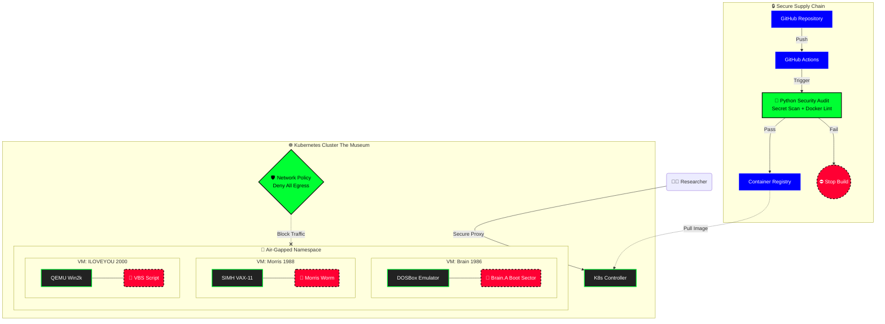

<div align="center">

# 👨‍💻 Julien PERRIN | Autodidacte depuis 20 ans

[](https://cybersecurityflux.dev)
[](https://fluxelectrique.com)

</div>

---

## 🎯 Profil

Passionné de technologie depuis plus de **20 ans**, je suis un **autodidacte** qui a transformé sa curiosité en expertise professionnelle. Technicien réparateur, développeur full-stack, et entrepreneur, je mets mes compétences au service de projets innovants dans les domaines de la **cybersécurité**, du **développement Android**, et de l'**administration système**.

> *"La passion du savoir et l'amour des choses bien faites"*

---

## 💼 Compétences Professionnelles

<div align="center">

<table>
<thead>
<tr>
<th width="50%" align="center">🔧 Hardware & Réparation</th>
<th width="50%" align="center">👨‍💻 Développement</th>
</tr>
</thead>
<tbody>
<tr>
<td valign="top">

### Technicien Expert
- 📱 **Réparation Smartphones** (iOS & Android)
- 💻 **Réparation Ordinateurs** (PC & Mac)
- 🔬 **Diagnostic Électronique** avancé
- ⚡ **Micro-soudure** & composants
- 🛠️ **Maintenance préventive** & curative
- 🔧 **Récupération de données**

</td>
<td valign="top">

### Développeur Full-Stack
- 🤖 **Spécialisation Android** (Kotlin/Java)
- 🌐 **Frontend** : HTML5, CSS3, JavaScript
- ⚙️ **Backend** : PHP, Python, Node.js
- 🗄️ **Bases de données** : MySQL, PostgreSQL
- 🔌 **API REST** & WebServices
- 📱 **Progressive Web Apps** (PWA)

</td>
</tr>
<tr>
<th align="center">🔐 Sécurité & Systèmes</th>
<th align="center">🎨 Design & UX</th>
</tr>
<tr>
<td valign="top">

### Cybersécurité & SysAdmin
- 🎓 **Formation Coursera** (en cours)
- 🔍 **Pentest** & Analyse de vulnérabilités
- 🛡️ **Hardening** & Sécurisation systèmes
- 🐧 **Linux** : Debian, Ubuntu, Arch (Expert)
- 🪟 **Windows** : 10/11, Server (Expert)
- 🍎 **macOS** & 🤖 **Android** (Avancé)
- 🐳 **Docker** & Conteneurisation
- 🔄 **CI/CD** & Automatisation

</td>
<td valign="top">

### Design & Création
- 📐 **Infographiste** Metteur en Page (certifié)
- 🎨 **UI/UX Design** & Wireframing
- 🖌️ **Identité Visuelle** & Branding
- 📱 **Responsive Design** mobile-first
- 🎯 **Adobe Suite** : Photoshop, Illustrator
- 💡 **Figma** & Prototypage
- 🌈 **Accessibilité** (WCAG)

</td>
</tr>
</tbody>
</table>

</div>

---

## 🌐 Mes Projets & Réalisations

<div align="center">

| Projet | Type | Technologie | Lien |
|:------:|:----:|:-----------:|:----:|
| 🔐 **CyberSecurity Flux** | Portfolio Tech & Cybersécurité | Full-Stack | [cybersecurityflux.dev](https://cybersecurityflux.dev) |
| 🏪 **L'esot'Lylaissé 71** | E-commerce | Web Development | [lesotlylaisse71.fr](https://lesotlylaisse71.fr) |
| 🐾 **Carineland** | Site Vitrine | Web Design | [carineland.fr](https://carineland.fr) |
| ⚡ **FluxElectrique** | Entreprise | Multi-services Tech | [fluxelectrique.com](https://www.fluxelectrique.com) |

</div>

---

## 🛠️ Stack Technique

<div align="center">

### Langages


### Systèmes & Outils


### Spécialisations


</div>

---

## 📊 GitHub Stats

<div align="center">

<a href="https://app.daily.dev/ujju16"></a>

[](https://github.com/ujju16)


</div>

---

## 📋 The Mermaid Code



## 🏗️ Architecture & Security Protocol

This project utilizes a **Zero-Trust** approach to malware analysis. The architecture is designed to bridge historical software preservation with modern DevSecOps standards.

### 1. 🔒 Secure Supply Chain (CI/CD)
Before any code reaches the cluster, it passes through a custom **Python Security Pipeline** (`scripts/security_audit.py`).
* **Static Analysis:** Scans for hardcoded secrets and vulnerable base images.
* **Integrity Checks:** Verifies SHA-256 hashes of malware artifacts to ensure authenticity without execution.
* **Linting:** Enforces non-root user execution in Dockerfiles.

### 2. 🛡️ The Air-Gapped Sandbox
The runtime environment is hosted on **Kubernetes**, leveraging namespaces for strict isolation.
* **Network Policies:** A `Deny-All-Egress` policy is applied to the `malware-zoo` namespace. No traffic can leave the pod, preventing worm propagation (e.g., Morris Worm).
* **Ephemeral Environments:** Containers are stateless. A restart wipes any persistence mechanisms attempted by the malware.

### 3. 🦠 Emulation Layer
Instead of virtualization, we use specific emulators (DOSBox, SIMH, QEMU) wrapped in minimal **Docker** containers. This allows us to run 16-bit and 32-bit legacy code on modern Linux nodes while maintaining a barrier between the host kernel and the malicious payload.

---

## 🏆 Badges & Certifications

<div align="center">

### 🎖️ Holopin Badges Board
[](https://holopin.io/@ujju16)

---

### 📜 Autres Certifications


</div>

---

## 🎓 Parcours & Formation

```
📅 20+ ans d'expérience autodidacte
🎨 Formation Infographiste Metteur en Page
🔧 Technicien Réparateur (Smartphones & Ordinateurs)
💻 Développeur Full-Stack (Spécialisation Android)
🔐 Études Cybersécurité (Coursera - En cours)
🚀 Entrepreneur (FluxElectrique.com)
```

---

## 💡 Ma Philosophie

<div align="center">

> *"J'adore mettre les mains dans le cambouis et opérer des appareils"*

> *"Hacker des systèmes, comprendre leur fonctionnement, et les améliorer"*

> *"Polyglotte du développement, DevOps et SysAdmin"*

</div>

---

## 📫 Me Contacter

<div align="center">

[](https://cybersecurityflux.dev)
[](mailto:jul.darrouza@gmail.com)
[](https://github.com/ujju16)

**FluxElectrique.com** - *Solutions Technologiques Complètes*

</div>

---

<div align="center">

### 🔥 *Passion pour le savoir • Amour des choses bien faites*


</div>
